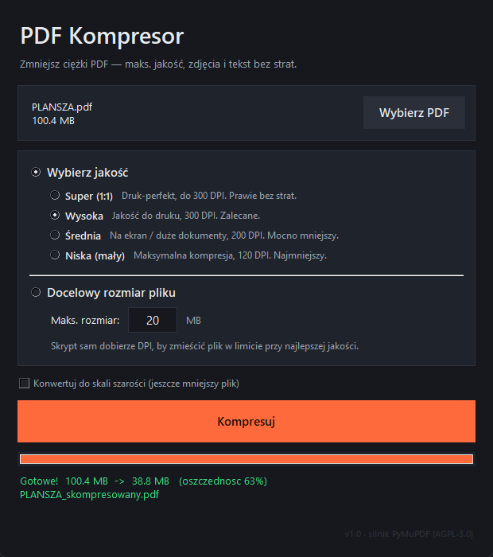

# PDF Kompresor

Mały program na Windows do zmniejszania wagi plików PDF. Zrobiłem go, bo żaden
darmowy kompresor online nie dawał rady z naprawdę ciężkimi plikami — plakat z
grafikami potrafił ważyć 100+ MB, a strony albo odbijały się od limitu rozmiaru,
albo masakrowały jakość zdjęć.

Ten program zmniejsza **tylko obrazy** w PDF (to one zajmują miejsce), a tekst i
grafikę wektorową zostawia w spokoju — dzięki temu napisy i cienkie linie zawsze
pozostają ostre.



## Pobranie (bez instalacji)

Gotowy `PDF Kompresor.exe` jest w zakładce **[Releases](../../releases)** — nie
wymaga Pythona ani instalacji, pobierasz i klikasz.

> Przy pierwszym uruchomieniu Windows SmartScreen może pokazać ostrzeżenie (plik
> nie jest podpisany płatnym certyfikatem). Kliknij *Więcej informacji →
> Uruchom mimo to*.

## Jak używać

1. Wskaż plik PDF.
2. Wybierz jakość albo wpisz docelowy rozmiar (np. „max 35 MB").
3. Kliknij **Kompresuj**.

Wynik zapisuje się obok oryginału jako `nazwa_skompresowany.pdf` — oryginał
zostaje nietknięty.

## Uruchomienie ze źródeł

Potrzebny Python 3.9+ (z Tkinter, czyli standardowa instalacja na Windows):

```
pip install -r requirements.txt
python pdf_kompresor.py
```

## Budowanie własnego .exe

```
build.bat
```

Powstaje `dist/PDF Kompresor.exe` z wbudowanym Pythonem i silnikiem — jeden plik,
działa na każdym Windowsie 64-bit.

## Jak to działa

Pod spodem jest [PyMuPDF](https://pymupdf.readthedocs.io/) i jego
`rewrite_images`: obrazy powyżej zadanego DPI są zmniejszane i przekodowywane do
JPEG o ustalonej jakości, a wszystko poniżej progu zostaje bez zmian.

| Tryb        | DPI | Jakość JPEG |
|-------------|----:|------------:|
| Super (1:1) | 300 |          95 |
| Wysoka      | 300 |          90 |
| Średnia     | 200 |          85 |
| Niska       | 120 |          72 |

Tryb „docelowy rozmiar" dobiera DPI metodą połowienia przedziału, żeby zmieścić
plik w zadanym limicie MB przy możliwie najlepszej jakości.

Konkret z życia: plakat B1 ze zdjęciami w 707 DPI, **105 MB → ~39 MB (−63%) w
~45 s**, bez widocznej różnicy przy druku.

## Licencja

[AGPL-3.0](LICENSE). Program korzysta z PyMuPDF / MuPDF (© Artifex Software),
która jest na AGPL — dlatego całość również. Do zastosowań komercyjnych z
zamkniętym kodem potrzebna jest komercyjna licencja PyMuPDF.
